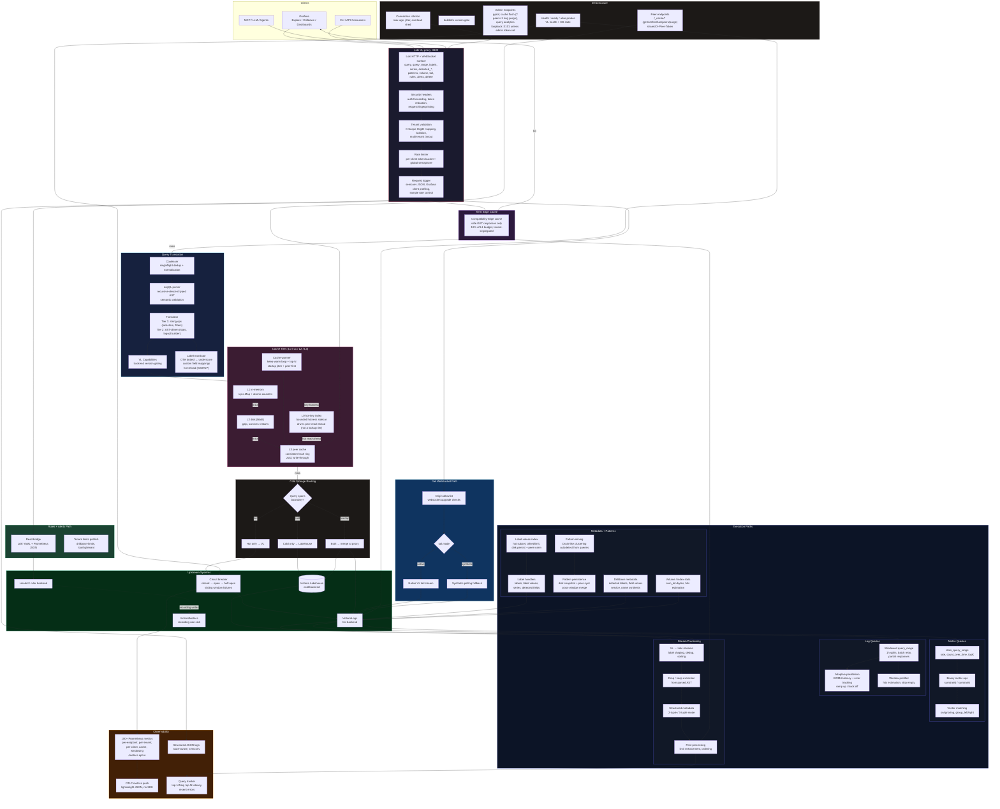
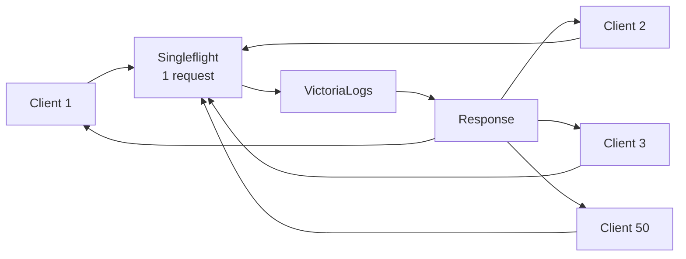
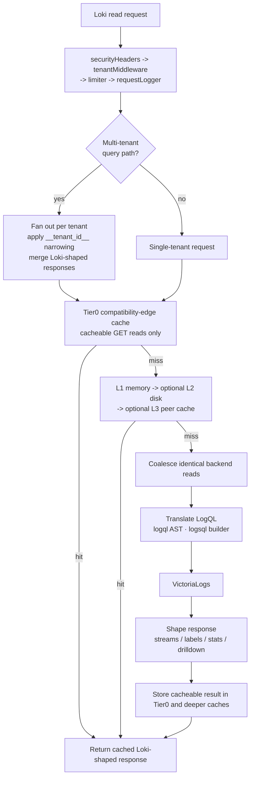
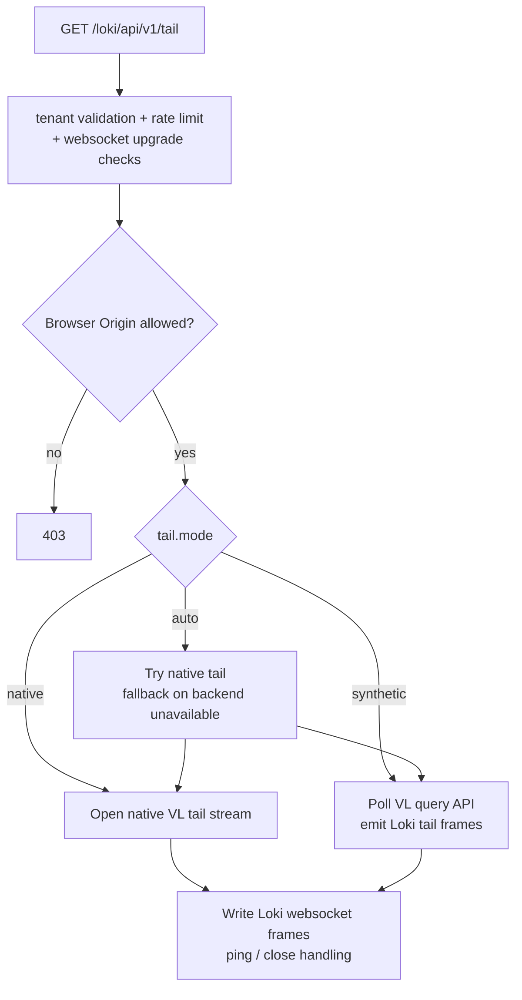
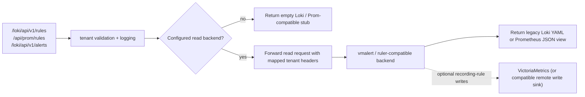
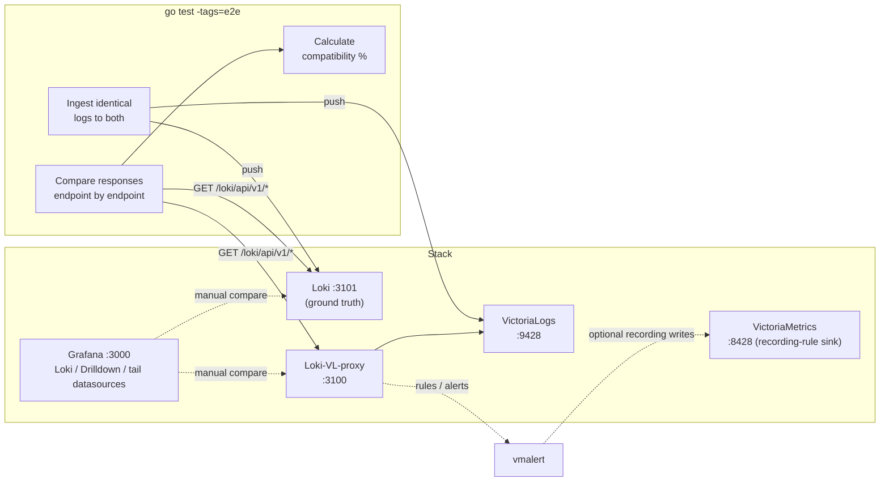
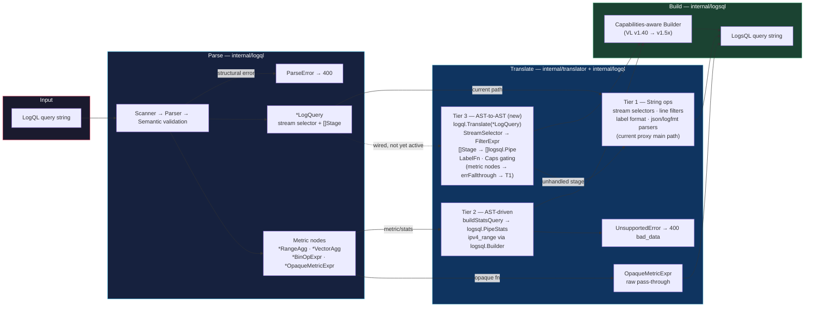

# Architecture

## Overview

Loki-VL-proxy is a read-only Loki compatibility proxy that sits between Grafana (or any Loki API client) and VictoriaLogs. It exposes Loki-compatible HTTP and WebSocket routes on the frontend, translates LogQL into LogsQL where needed, shapes VictoriaLogs responses back into Loki-compatible structures, and optionally exposes rules and alerts reads from a separate backend such as `vmalert`.

## Runtime Paths

## Protection Layers

| Layer | Purpose | Default Config |
|---|---|---|
| Tenant validation | Enforce Loki-style tenant header policy and mapping rules before backend access | Enabled on tenant-scoped routes |
| Per-client rate limiter | Prevent individual client abuse | `-rate-limit-per-second=50`, `-rate-limit-burst=100` |
| Global concurrent limit | Cap in-flight requests and backend operations (including fanout, until response bodies are consumed) | `-max-concurrent=100` (Helm chart default `64`) |
| Request coalescing | Deduplicate identical queries | Automatic (singleflight) |
| Query normalization | Improve cache hit rate | Sort matchers, collapse whitespace |
| Tier0 response cache | Short-circuit repeated safe GET reads after tenant validation | Enabled, 10% of L1 memory budget, safe GET read endpoints only |
| Tiered cache | Reduce backend calls with local, disk, and peer reuse | L1 memory, optional L2 disk, optional L3 peer cache |
| Query-length enforcement | Reject requests whose time range exceeds the configured maximum | `-default-max-query-length=0` (disabled); per-tenant override via limits config; tenant limit takes precedence |
| Stats series and concurrency caps | Bound stats responses and parallel `stats_query_range` calls | `-max-stats-query-series=0` (built-in `500`), `-stats-query-range-concurrency=0` (built-in `4`) |
| Metadata lookback | Bound `/labels`, `/label/{name}/values` and `/series` when the client omits `start`/`end` | `-metadata-default-lookback=12h` |
| Execution budgets | Reject oversized raw metric scans, binary expressions and `line_format` output with explicit errors instead of partial results | `-manual-range-metric-row-limit=1000000` plus fixed budgets; see [Security hardening migration](security-hardening-migration.md) |
| Circuit breaker | Protect VL from cascading failure | `-cb-fail-threshold=5` failures within `-cb-window-duration=30s`, `-cb-open-duration=10s` |
| Backend error redaction | Strip query-like content (selectors, long quoted literals, long hex ids) from VictoriaLogs error bodies and transport errors before logging or returning them | Enabled; disabled only by `-debug-log-raw-queries=true` |
| Admin and peer exposure | Keep admin/debug routes off the public listener and authenticate peer cache traffic | Admin routes on `-admin-listen=127.0.0.1:3101` unless `-server.admin-auth-token` is set; `/metrics` requires `-server.register-instrumentation=true`; peer cache refuses to start without `-peer-auth-token` unless `-peer-insecure-ip-allowlist=true` |
| Tail origin allowlist | Reject browser websocket origins unless explicitly trusted | Deny browser origins by default |

### How Coalescing Works

When 50 Grafana dashboards send `{app="nginx"} |= "error"` simultaneously:

Only **1** request reaches VictoriaLogs. All clients get the same response. Coalescing and cache keys include a scope fingerprint derived from the resolved tenant routing, backend identity, field mappings and forwarded identity, so requests from different tenants or authorization scopes never share a backend response.

## Query And Metadata Flow

### Tier0 Cache Guardrails

- Tier0 is a separate cache instance that reuses the same cache implementation, but not the same keyspace, as the deeper L1/L2/L3 caches.
- It runs only after tenant validation, auth checks, request logging setup, and route classification.
- It only serves cacheable `GET` read endpoints such as `query`, `query_range`, `series`, labels, volume, patterns, and Drilldown metadata.
- It never covers `/tail`, write/delete/admin paths, websocket upgrades, or non-JSON responses.
- Its memory budget is derived from `-cache-max-bytes` through `-compat-cache-max-percent`, defaulting to 10% and capped at 50%.
- Tenant-map and field-mapping reloads invalidate Tier0 immediately so label translation and metadata exposure changes cannot go stale.

### Cold Storage Routing

When `-cold-enabled=true` and `-cold-backend` is set, the proxy time-splits queries based on their time range:

| Query range | Route |
|---|---|
| Entirely within hot boundary | Hot backend (VictoriaLogs) only |
| Entirely beyond cold boundary | Cold backend (Victoria Lakehouse) only |
| Spans the boundary (overlap zone) | Both backends; results merged at proxy |

The boundary is configured via `-cold-boundary` (default `168h` = 7 days). The overlap window (`-cold-overlap`, default `1h`) ensures no gaps around the boundary by querying both backends in that zone.

For backward-direction queries spanning both backends, the proxy keeps at most `limit` cold lines (up to 5,000) in a ring buffer to reverse them before merging. Hot and forward-cold responses are buffered up to 64 MiB each; overflow or a read failure returns an error instead of a partial result.

## Tail Flow

## Rules And Alerts Read Flow

## Data Model Mapping

### Loki vs VictoriaLogs

| Loki Concept | VL Equivalent |
|---|---|
| Stream labels | `_stream` fields (declared at ingestion) |
| Structured metadata | Regular fields (all others) |
| Timestamp | `_time` |
| Log line body | `_msg` |
| Parsed labels | Fields from `| unpack_json` / `| unpack_logfmt` |

VictoriaLogs treats all fields equally, while Loki 3.x distinguishes stream labels, structured metadata, and parsed labels. In practice, Grafana Explore handles both transparently.

Log query responses group entries into streams the way Loki does: by stream labels plus the labels extracted by `| json` / `| logfmt`. With the `categorize-labels` encoding (and `-emit-structured-metadata`), extracted labels stay out of the stream object and are returned in each entry's `parsed` metadata; a `level` field returned by VictoriaLogs still adds `level` and `detected_level` to the stream labels. Single-request, windowed (`-query-range-windowing`) and `-stream-response` log queries share this stream resolution.

### Label Translation

VictoriaLogs stores OTel attributes with native dotted names (`service.name`), while Loki uses underscores (`service_name`). The `-label-style` flag controls translation:

| Mode | Response Direction | Query Direction |
|---|---|---|
| `passthrough` | No translation | No translation |
| `underscores` | `service.name` → `service_name` | `{service_name="x"}` → VL `"service.name":"x"` |

Built-in reverse mappings cover 50+ OTel semantic convention fields.

## E2E Test Architecture

## Component Design

### LogQL Parser (`internal/logql/`)
Typed recursive-descent parser for LogQL. Produces a fully-typed AST (`Expr` interface with concrete node types: `*LogQuery`, `*RangeAggregation`, `*VectorAggregation`, `*BinOpExpr`, `*OpaqueMetricExpr`, …) that drives three subsystems:

- **Validation** — `ValidateLogQL(query)` returns Loki-compatible error strings for invalid queries before any work is done.
- **Routing** — `proxy.go` type-switches on the parsed AST to dispatch binary metric expressions, range aggregations and stream queries to separate execution paths (more reliable than regex-based marker injection).
- **Drop/Keep extraction** — `stream_processing.go` extracts `| drop`/`| keep` matchers from the AST for VL response post-processing.

The parser includes a semantic pass for structural constraints (missing `| unwrap` inside `rate_counter`, `__error__` inside `rate()`, malformed `ip()` filters, quantile phi bounds, line-format template validity). All error messages are formatted to match Loki 3.x exactly so Grafana clients receive the expected error shape.

See [LogQL Parser deep dive](logql-parser.md) for grammar, data flow diagrams, and extension points.

### Translator (`internal/translator/`)
LogQL→LogsQL converter. Receives canonical LogQL (produced by `Expr.String()` after AST normalisation). Translation uses two tiers: stable string operations for well-understood paths (stream selectors, line filters, label format) and typed `logsql` builder calls for complex paths (stats aggregations, IP filters).

Typed errors in `internal/translator/errors.go` replace bare `fmt.Errorf` for two failure classes: `ParseError` (invalid LogQL input) and `UnsupportedError` (LogQL constructs with no LogsQL equivalent). Callers can type-assert to distinguish parse failures from unsupported constructs; the query handlers return both as HTTP 400 with `errorType: bad_data`.

`internal/logql/translate.go` adds a second, typed translation path alongside the string-based translator: `Translate(expr Expr, opts TranslateOptions) (string, error)`. For `*LogQuery` nodes it performs a direct AST-to-AST mapping — stream selector → `logsql.FilterExpr`, pipeline stages → `[]logsql.Pipe` — without a `String()` roundtrip. Metric nodes (`*RangeAggregation`, `*VectorAggregation`, `*BinOpExpr`, `*OpaqueMetricExpr`) return an `errFallthrough` sentinel that routes to the existing string translator unchanged. `TranslateOptions` carries `LabelFn`, `StreamFields`, and `Caps`; the `Caps` field gates VL version-specific features. The proxy's main translation path (`translator.TranslateLogQLWithCapabilities`) is unchanged — `logql.Translate` is wired but not yet called by handlers.

### Translation Pipeline

See [LogQL parser — Translation](logql-parser.md#translation) for the stage-by-stage mapping table and edge case reference.

### Proxy (`internal/proxy/`)
HTTP handlers for Loki-compatible read endpoints, split into domain-focused modules.

The `Proxy` struct is decomposed into three explicit types (migration in progress):

- **`Deps`** (`deps.go`) — external dependencies: backend URLs, HTTP clients, caches, logger, metrics, rate limiter, circuit breaker.
- **`HandlerConfig`** (`config.go`) — immutable startup configuration (83 flag-derived fields); pointer-shared across goroutines.
- **`State`** (`state.go`) — mutable runtime state: tenant maps, label indices, pattern snapshots, backend version, atomics; pointer-typed mutexes for safe sharing.
- **`Handler{Deps, Cfg *HandlerConfig, State *State}`** (`handler.go`) — carries all three concerns; populated by `New()`; `routeHandler` method extracted from the former anonymous `rl` closure in `RegisterRoutes`.

| Module | Responsibility |
|---|---|
| `handler.go` | `Handler` struct definition and `routeHandler` dispatch method |
| `deps.go` | `Deps` struct: external dependency container |
| `config.go` | `HandlerConfig` struct: immutable startup configuration |
| `state.go` | `State` struct: mutable runtime state |
| `proxy.go` | Constructor (`New()`), `RegisterRoutes`, and remaining Proxy wiring |
| `middleware.go` | Request middleware chain: security headers, tenant validation, rate limiting, WebSocket upgrade checks |
| `middleware_security.go` | Security-specific middleware: auth forwarding, token redaction, request fingerprinting |
| `query_translation.go` | LogQL→LogsQL translation per request, structured request logging |
| `query_range_windowing.go` | Time-window splitting and stitching for long-range metric queries |
| `stream_processing.go` | VL→Loki stream conversion, label shaping, log line proxying |
| `postprocess.go` | Post-query response shaping: limit enforcement, deduplication, sorting |
| `multitenant.go` | Multi-tenant fanout, per-tenant narrowing, and Loki-shaped response merging |
| `label_handlers.go` | `/labels`, `/label/{name}/values`, `/series`, `/detected_fields` HTTP handlers |
| `label_metadata.go` | VL metadata fetching: field discovery, OTel attribute detection |
| `label_index.go` | In-process label-values index for low-latency label cardinality queries |
| `cache_keys.go` | Cache key construction: query_range, labels, series, detected_fields, volume |
| `patterns.go` | Pattern query handling, autodetection from query history, pattern clustering |
| `patterns_persistence.go` | Pattern snapshot persistence: load, save, and rotation |
| `metric_agg.go` | Instant-vector queries and post-aggregation metric math |
| `metric_binary.go` | Stats queries and binary metric expression evaluation |
| `volume.go` | `/loki/api/v1/index/volume` and `/index/volume_range` handlers |
| `drilldown.go` | Logs Drilldown plugin metadata endpoints |
| `tail.go` | WebSocket `/tail` with native VL stream and synthetic polling fallback |
| `alerting.go` | Health/readiness probes, rules and alerts read-through handlers |
| `backend.go` | Backend HTTP client construction, TLS config, compression negotiation |
| `telemetry.go` | Per-route Prometheus instrumentation, OTLP push, request duration histograms |
| `time_utils.go` | Timestamp parsing, range normalization, step alignment helpers |
| `http_utils.go` | HTTP error helpers, response header forwarding, Accept-Encoding negotiation |
| `metric_eval_limits.go` | Evaluation point/sample bounds and numeric helpers shared by proxy-side metric evaluation |
| `range_metric_compat.go` | Range metric compatibility shims for Loki 2.x vs 3.x divergences |
| `vector_matching.go` | Vector matching logic for binary metric operations |
| `unwrap_convert.go` | `unwrap` expression conversion between LogQL and LogsQL forms |
| `redact.go` | Token and credential redaction from logs and error messages |
| `safety.go` | Query safety checks: cardinality limits, expression complexity guards |

### Middleware (`internal/middleware/`)
- **Rate limiter**: per-client token bucket + global semaphore (`-rate-limit-per-second`, `-rate-limit-burst`, `-max-concurrent`)
- **Coalescer**: singleflight-based request deduplication
- **Circuit breaker**: 3-state (closed/open/half-open) with a sliding failure window (`-cb-fail-threshold`, `-cb-window-duration`, `-cb-open-duration`)

### Cache (`internal/cache/`)
Three lookup tiers: L1 in-memory (sync.Map + atomic counters), optional L2 on-disk (bbolt with gzip compression), and optional L3 peer cache (consistent hash ring, `zstd`/`gzip` on larger peer transfers). L0 is a bounded hot-key index beside L1 that drives peer hot read-ahead; it is reported as `tier="l0"` in cache metrics but is not a lookup tier. `POST /admin/cache/flush` clears L0, L1 and L2 locally; with `?peers=1` it also fans out to every peer's `/_cache/purge`. Disk encryption is delegated to cloud provider (EBS, PD, etc.).

### Metrics (`internal/metrics/`)
Prometheus text exposition at `/metrics` (served only with `-server.register-instrumentation=true`, optionally on a dedicated `-metrics-listen` address) plus OTLP push. Route-aware downstream and upstream request metrics, tenant/client breakdowns, cache and windowing metrics, peer-cache state, circuit-breaker state, and prefixed process/runtime health.
