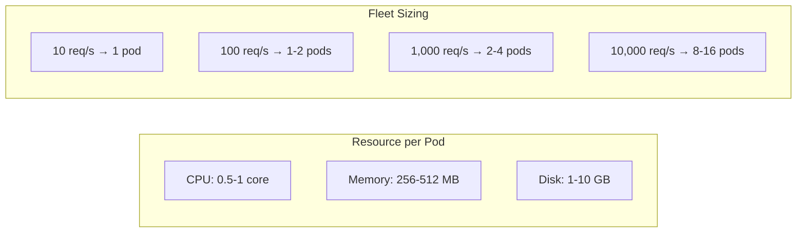
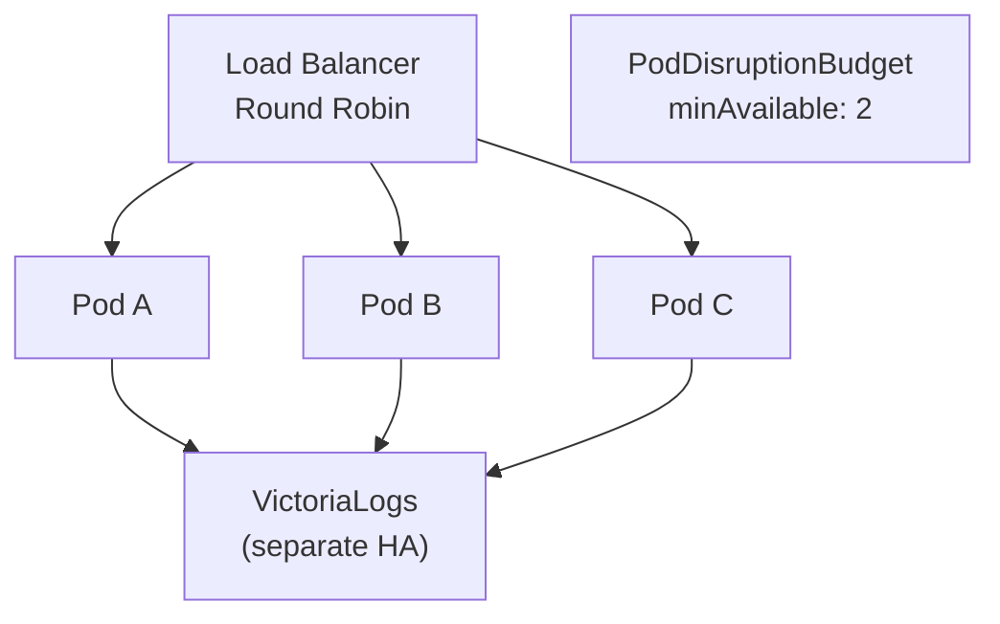
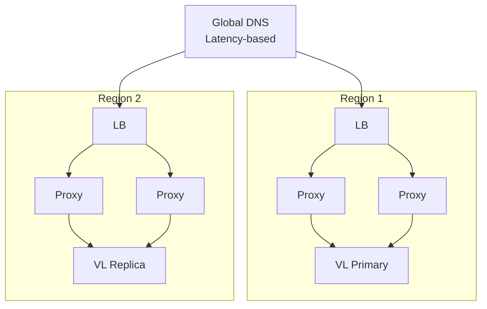

# Scaling & Capacity Planning

## Resource Model

Loki-VL-proxy is a stateless HTTP proxy with optional disk cache. Resource consumption scales with:
- **CPU**: proportional to request rate + LogQL translation complexity
- **Memory**: proportional to L1 cache size + concurrent request response buffers
- **Disk**: proportional to L2 cache size (compressed, ~3.4x reduction with gzip)
- **Network**: proportional to request rate × response size

## Resource Projections

Based on benchmarks (Go 1.26.2, single core, typical Grafana dashboard workload with 60% cache hit rate):

### Single Replica

| Metric | 10 req/s | 100 req/s | 1,000 req/s | 10,000 req/s |
|--------|----------|-----------|-------------|--------------|
| **CPU (cores)** | 0.01 | 0.1 | 0.5-1.0 | 4-8 |
| **Memory (MB)** | 50-100 | 100-256 | 256-512 | 512-2048 |
| **L1 Cache (entries)** | 1,000 | 5,000 | 10,000 | 50,000 |
| **L1 Cache (MB)** | 10-50 | 50-100 | 100-256 | 256-512 |
| **Network in (Mbps)** | 0.1 | 1 | 10 | 50-100 |
| **Network out (Mbps)** | 0.5 | 5 | 50 | 200-500 |
| **VL queries/s** | 4 (60% cached) | 40 | 400 | 2,000-4,000 |
| **Goroutines** | 20-50 | 50-200 | 200-1,000 | 1,000-5,000 |

### Disk Cache (L2)

| Disk Size | Entries (compressed) | Hit Rate Boost | Use Case |
|-----------|---------------------|----------------|----------|
| 1 GB | ~18k | +10-15% | Small team, development |
| 5 GB | ~94k | +15-25% | Medium org, shared dashboards |
| 10 GB | ~189k | +20-30% | Large org, heavy dashboard usage |
| 50 GB | ~948k | +25-35% | Enterprise, long TTL requirements |

Compression ratio: ~29% (gzip), meaning 1 GB on disk holds ~3.4 GB of raw cache data.

### Fleet (Multiple Replicas)



| Total req/s | Replicas | CPU (total) | Memory (total) | Disk (total) | Cache Hit Rate |
|-------------|----------|-------------|----------------|--------------|----------------|
| 10 | 1 | 0.1 core | 128 MB | 1 GB | 60-70% |
| 100 | 2 | 0.5 cores | 512 MB | 2 GB | 65-75% |
| 1,000 | 4 | 2-4 cores | 1-2 GB | 10 GB | 70-80% |
| 10,000 | 16 | 8-16 cores | 4-8 GB | 40 GB | 75-85% |

With fleet peer cache, the effective cache size is `L1_per_pod × N + L2_per_pod × N`, and cache hit rate improves because each key lives on exactly one peer (no duplication across pods).

## Workload Profiles

### Dashboard-Heavy (Grafana auto-refresh)

```
Characteristics: 70-85% repeat queries, 15-30 panels per dashboard, 5-60s refresh
Cache behavior: Very high hit rate after first load
Bottleneck: Memory (large response buffers), Network out
```

| Dashboards | Users | req/s | Recommended |
|------------|-------|-------|-------------|
| 10 | 5 | 10-50 | 1 pod, 256MB, 1GB disk |
| 50 | 25 | 50-250 | 2 pods, 512MB, 5GB disk |
| 200 | 100 | 200-1000 | 4 pods, 1GB, 10GB disk |
| 1000 | 500 | 1000-5000 | 8-16 pods, 2GB, 10GB disk |

### Explore-Heavy (Ad-hoc queries)

```
Characteristics: 20-30% repeat queries, unique time ranges, high cardinality
Cache behavior: Lower hit rate, disk cache catches some repeats
Bottleneck: CPU (translation), VL backend throughput
```

| Active Users | req/s | Recommended |
|-------------|-------|-------------|
| 5 | 5-20 | 1 pod, 256MB, 1GB disk |
| 25 | 25-100 | 2 pods, 512MB, 5GB disk |
| 100 | 100-500 | 4 pods, 1GB, 10GB disk |
| 500 | 500-2000 | 8 pods, 2GB, 20GB disk |

### Mixed (Production Typical)

```
Characteristics: 50% dashboards, 30% alerts, 20% explore
Cache behavior: Moderate hit rate, steady state after warm-up
Bottleneck: Balanced CPU/memory/network
```

## Helm Values by Scale

### Small (< 100 req/s)

```yaml
replicaCount: 1
workload:
  kind: StatefulSet
resources:
  requests:
    cpu: 100m
    memory: 128Mi
  limits:
    cpu: 500m
    memory: 256Mi
extraArgs:
  cache-ttl: "60s"
  cache-max: "5000"
  disk-cache-path: "/cache/proxy.db"
  disk-cache-compress: "true"
persistence:
  enabled: true
  size: 1Gi
```

### Medium (100-1,000 req/s)

```yaml
replicaCount: 3
workload:
  kind: StatefulSet
resources:
  requests:
    cpu: 250m
    memory: 256Mi
  limits:
    cpu: "1"
    memory: 512Mi
extraArgs:
  cache-ttl: "60s"
  cache-max: "10000"
  disk-cache-path: "/cache/proxy.db"
  disk-cache-compress: "true"
peerCache:
  enabled: true
  discovery: dns
persistence:
  enabled: true
  size: 5Gi
horizontalPodAutoscaling:
  enabled: true
  minReplicas: 2
  maxReplicas: 6
  metrics:
    - type: Resource
      resource:
        name: cpu
        target:
          type: Utilization
          averageUtilization: 70
```

### Large (1,000-10,000 req/s)

```yaml
replicaCount: 8
workload:
  kind: StatefulSet
resources:
  requests:
    cpu: 500m
    memory: 512Mi
  limits:
    cpu: "2"
    memory: 2Gi
extraArgs:
  cache-ttl: "120s"
  cache-max: "50000"
  disk-cache-path: "/cache/proxy.db"
  disk-cache-compress: "true"
  disk-cache-flush-size: "500"
peerCache:
  enabled: true
  discovery: dns
persistence:
  enabled: true
  size: 10Gi
  storageClass: gp3  # high IOPS SSD
horizontalPodAutoscaling:
  enabled: true
  minReplicas: 4
  maxReplicas: 20
  metrics:
    - type: Resource
      resource:
        name: cpu
        target:
          type: Utilization
          averageUtilization: 60
podDisruptionBudget:
  minAvailable: 2
```

The proxy exposes all traffic-shaping controls as CLI flags, passable via `extraArgs` in the Helm chart:

| Flag | Default | Description |
|---|---|---|
| `-rate-limit-per-second` | `50` | Per-client request rate (req/s) |
| `-rate-limit-burst` | `100` | Per-client burst allowance |
| `-max-concurrent` | `100` | Global concurrent backend query cap |
| `-cb-fail-threshold` | `5` | Failures within window to open circuit breaker |
| `-cb-open-duration` | `10s` | Duration circuit breaker stays open |

```yaml
extraArgs:
  max-concurrent: "200"
  rate-limit-per-second: "100"
  rate-limit-burst: "200"
  cb-open-duration: "30s"
```

Use HPA, cache sizing, Grafana refresh policy, and outer traffic shaping as complementary scaling controls.

### Adaptive Parallelism

The proxy automatically adjusts per-request window parallelism based on observed backend latency:

| Flag | Default | Description |
|---|---|---|
| `-query-range-adaptive-parallel` | `true` | Enable adaptive parallelism |
| `-query-range-adaptive-min-parallel` | `2` | Minimum concurrent windows |
| `-query-range-adaptive-max-parallel` | `8` | Maximum concurrent windows |
| `-query-range-latency-target` | `1500ms` | Target p50 latency per window |
| `-query-range-adaptive-cooldown` | `30s` | How long to wait after scaling down before scaling up again |

When window latency exceeds `-query-range-latency-target`, the proxy scales down parallelism (down to `min-parallel`). When latency is healthy, it scales back up. This prevents overloading VL during heavy fan-out periods.

**Tuning guidance:**
- Increase `max-parallel` (e.g. 16) only when VL has spare capacity and queries are bottlenecked by window count, not backend throughput.
- Decrease `latency-target` (e.g. 800ms) for latency-sensitive dashboards.
- Leave `min-parallel=2` unless VL is severely resource-constrained.

### Peer Cache Discovery

Four discovery modes control how peers find each other. All of them need the same `-peer-auth-token` on every peer: the proxy refuses to start with peer discovery configured and no token, unless `-peer-insecure-ip-allowlist=true` restores the legacy IP-only check. With `peerCache.enabled=true` the Helm chart wires the discovery flags and the token Secret automatically.

**DNS discovery (recommended for HPA):**
```bash
-peer-discovery=dns
-peer-dns=loki-vl-proxy-headless.default.svc.cluster.local
-peer-auth-token=shared-secret
```
The proxy resolves the headless service DNS to get peer IPs and reaches each peer on the fixed port `3100`. New replicas auto-join as they come up. Works correctly with HPA scale-out.

**SRV discovery (port from the record):**
```bash
-peer-discovery=srv
-peer-srv=_loki-vl-proxy._tcp.loki-vl-proxy-headless.default.svc.cluster.local
-peer-auth-token=shared-secret
```

**HTTP discovery (Consul, Prometheus HTTP SD, custom registries):**
```bash
-peer-discovery=http
-peer-http-url=http://consul:8500/v1/catalog/service/loki-vl-proxy
-peer-auth-token=shared-secret
```

**Static discovery (for fixed fleets):**
```bash
-peer-discovery=static
-peer-static=10.0.0.1:3100,10.0.0.2:3100,10.0.0.3:3100
-peer-auth-token=shared-secret
```
Peers are hardcoded. Simpler but requires restart on topology changes.

`dns`, `srv` and `http` refresh the ring every 15 s. `GET /_cache/peers` (with `X-Peer-Token`) shows the current ring, and `POST /admin/cache/flush?peers=1` purges caches fleet-wide. See [Fleet Cache](fleet-cache.md) for response formats, the chart's token Secret handling and the ring-wide flush.

## Monitoring Metrics

### Per-Tenant (Rate, Throughput, Latency)

```promql
# Request rate per tenant
sum(rate(loki_vl_proxy_tenant_requests_total{system="loki",direction="downstream"}[5m])) by (tenant)

# P99 latency per tenant
histogram_quantile(0.99, sum(rate(loki_vl_proxy_tenant_request_duration_seconds_bucket{system="loki",direction="downstream"}[5m])) by (le, tenant))

# Error rate per tenant
sum(rate(loki_vl_proxy_tenant_requests_total{status=~"4..|5.."}[5m])) by (tenant)
  / sum(rate(loki_vl_proxy_tenant_requests_total[5m])) by (tenant)
```

### Per-Client (User Identity)

Client identity is resolved from (priority order):
1. Trusted user headers when `-metrics.trust-proxy-headers=true` (`X-Grafana-User`, `X-Forwarded-User`, `X-Webauth-User`, `X-Auth-Request-User`)
2. `X-Scope-OrgID` header (tenant)
3. `X-Forwarded-For` when `-metrics.trust-proxy-headers=true`
4. Remote IP (fallback)

Datasource/basic-auth credentials are tracked separately and are not used as client identity.

```promql
# Request rate per client
sum(rate(loki_vl_proxy_client_requests_total{system="loki",direction="downstream"}[5m])) by (client)

# Throughput per client (bytes/s)
sum(rate(loki_vl_proxy_client_response_bytes_total[5m])) by (client)

# P95 latency per client
histogram_quantile(0.95, sum(rate(loki_vl_proxy_client_request_duration_seconds_bucket{system="loki",direction="downstream"}[5m])) by (le, client))

# Top 10 clients by request count
topk(10, sum(rate(loki_vl_proxy_client_requests_total[5m])) by (client))

# Clients generating the most 429s
topk(10, sum(rate(loki_vl_proxy_client_status_total{status="429"}[5m])) by (client))

# Clients issuing the largest queries
topk(10, histogram_quantile(0.95, sum(rate(loki_vl_proxy_client_query_length_chars_bucket{system="loki",direction="downstream"}[5m])) by (le, client)))
```

### Fleet Peer-Cache

```promql
# Current remote peers per proxy
loki_vl_proxy_peer_cache_peers

# Total fleet members in the hash ring
loki_vl_proxy_peer_cache_cluster_members

# Peer cache effectiveness
rate(loki_vl_proxy_peer_cache_hits_total[5m])
/
(rate(loki_vl_proxy_peer_cache_hits_total[5m]) + rate(loki_vl_proxy_peer_cache_misses_total[5m]))

# Peer fetch failure rate
rate(loki_vl_proxy_peer_cache_errors_total[5m])
```

### Cache Efficiency

```promql
# Overall cache hit rate
loki_vl_proxy_cache_hits_total / (loki_vl_proxy_cache_hits_total + loki_vl_proxy_cache_misses_total)

# VL backend load (actual queries reaching VL)
sum(rate(loki_vl_proxy_backend_duration_seconds_count[5m]))

# Backend requests saved by coalescing
rate(loki_vl_proxy_coalesced_saved_total[5m])
```

### Resource Utilization

```promql
# Heap usage vs limit
go_memstats_alloc_bytes / go_memstats_sys_bytes

# Active goroutines (proxy concurrency)
go_goroutines

# GC pressure
rate(go_gc_cycles_total[5m])
```

## Availability Patterns

### Single-Region HA



- Minimum 3 replicas for HA
- PDB ensures at least 2 pods during rolling updates
- Anti-affinity spreads pods across nodes/zones
- Proxy is stateless — any pod can serve any request
- Set `-warmup-max-jitter` to spread label cache warmup across the fleet on rolling restart — without it all pods hit VL simultaneously on redeploy. Recommended: `10s` for ≤15 pods, `20s` for ≤30 pods. See [Fleet Cache Architecture](fleet-cache.md#startup-coordination-and-fleet-restart-safety).

### Multi-Region



## Disk I/O Characteristics

The L2 disk cache uses bbolt (B+ tree) optimized for sequential I/O:

| Operation | Latency | IOPS | Notes |
|-----------|---------|------|-------|
| Read (cache hit) | ~22µs | ~45,000/s | Sequential B+ tree scan |
| Write (batch flush) | ~200µs/batch | ~5,000 entries/s | Write-back buffer, async |
| Compaction | Background | Minimal | bbolt self-manages |

Disk type recommendations:
- **gp3/gp2 SSD**: Best for < 1,000 req/s
- **io2/io1 SSD**: For > 1,000 req/s with high cache churn
- **st1 HDD**: Viable for read-heavy, low-churn workloads (bbolt's sequential I/O is HDD-friendly)

## Cost Estimation

Example: AWS EKS, us-east-1, 1,000 req/s workload

| Component | Spec | Monthly Cost |
|-----------|------|-------------|
| 4x t3.medium pods | 2 vCPU, 4GB RAM | ~$120 |
| 4x 10GB gp3 volumes | 3,000 IOPS, 125 MB/s | ~$14 |
| VictoriaLogs (backend) | Varies | Varies |
| **Total proxy infra** | | **~$134/month** |

Treat this as proxy-only infrastructure cost, not a full backend comparison. Actual Loki versus VictoriaLogs economics depend on ingestion profile, retention window, storage class, and query mix. Loki's own docs note that high-cardinality labels hurt performance and cost-effectiveness, while VictoriaLogs publishes lower-RAM and lower-disk claims and third-party case studies report materially lower CPU, RAM, and storage usage on search-heavy workloads. Use the route-aware metrics and cache ratios in this project to validate the savings against your own traffic rather than assuming a fixed multiplier.